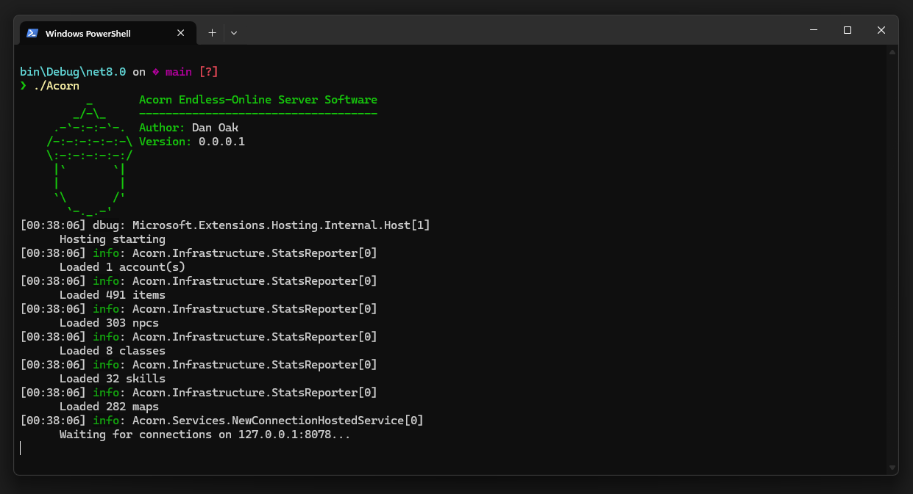

# Project Acorn
## Overview

**Project Acorn** The C# Endless Online Server Emulator




## Features

- **SQLite** support
- **MSSQL** support coming soon (tm)

## Prerequisites

- [.NET SDK](https://dotnet.microsoft.com/download)

## Building the Project

1. Clone the repository:
    ```sh
    git clone https://github.com/yourusername/project-acorn.git
    cd project-acorn
    ```

2. Restore dependencies:
    ```sh
    dotnet restore
    ```

3. Build the project:
    ```sh
    dotnet build
    ```

## Running the Project

1. Run the application:
    ```sh
    dotnet run
    ```

2. For MSSQL support (coming soon):
    ```sh
    docker-compose up
    ```

## Contributing

We welcome contributions! Please see our [contributing guidelines](CONTRIBUTING.md) for more details.

## License

This project is licensed under the MIT License. See the LICENSE file for details.

## Acknowledgements

- **EthanMoffat:** `eolib-dotnet` and `EndlessClient`
- **Cirras:** `eo-protocol`
- **Sorokya:** `reoserv`
- **Sausage:** `EOSERV`
- **Vult-r:** Original software
